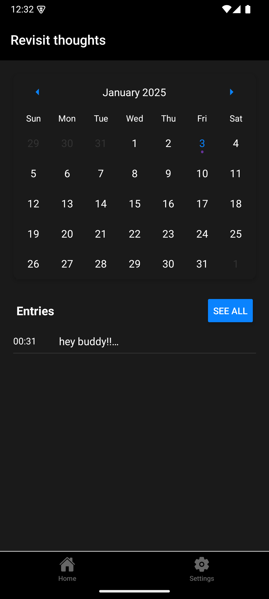

# Journal

A minimalist journaling app that automatically timestamps and organizes your daily thoughts. Built with React Native and Expo, focusing on simplicity and offline-first experience.

## Features

### Writing Experience
- 🖋️ Distraction-free writing interface
- ⚡ Auto-save as you type
- ⏰ Automatic timestamping of entries
- 📱 Works offline - all data stored locally

### Entry Management
- 📅 Calendar view with visually marked dates containing entries
- 📊 Timeline view for daily entries
- 🔍 Preview entries with "See All" expansion
- 📋 Chronological sorting of daily entries

### Themes & UI
- 🌓 Dark/Light mode support
- 🎨 System theme integration
- 💾 Theme preference persistence
- 🎯 Clean, minimalist interface

### Data Management
- 📤 Export entries as JSON/CSV
- 📥 Import entries from backup files
- 🔒 Local SQLite storage
- 🔄 No internet required

## Screenshots

<div align="center">

| Light Mode | Dark Mode |
|:----------:|:---------:|
|  |  |
|  |  |
|  |  |
|  |  |

</div>

## Installation

### Prerequisites
- Node.js (v16 or later)
- npm
- Android Studio (for Android development)
- Android SDK Platform-Tools

### Development Setup

1. Clone the repository
```bash
git clone https://github.com/sPrhr/Journal.git
cd Journal
```

2. Install dependencies
```bash
npm install
```

### Testing with Expo Go

1. Install Expo Go on your Android device from the Play Store

2. Start the development server:
```bash
npx expo start
```

3. Connect to the development server:
   - Scan the QR code with your Android device
   - Or use the Expo Go app and enter the URL manually
   - Make sure your phone and development machine are on the same network

### Prebuild Setup

1. Run prebuild for Android
```bash
npx expo prebuild --platform android
```

2. Configure Android development environment:
   - Install Android Studio
   - Install Android SDK (minimum SDK 21)
   - Set up Android environment variables:
     - ANDROID_HOME
     - JAVA_HOME

3. Verify setup
```bash
npx expo doctor
```

### Building for Android

1. Generate debug build
```bash
cd android
./gradlew assembleDebug
```

2. Generate release build
```bash
cd android
./gradlew clean
./gradlew assembleRelease
```

The APK will be generated at:
```
android/app/build/outputs/apk/release/app-release.apk
```

### Installing on Android Device/Emulator

Method 1: Using APK file
- Locate the generated APK in the build folder
- Drag and drop the APK onto your running emulator
- Or install on physical device by transferring the APK

Method 2: Using development build
```bash
npm run android
```

## Usage

### Writing Entries
1. Open the app
2. Start typing in the main screen
3. Entries are automatically saved with timestamps

### Viewing Entries
1. Navigate to Entries tab
2. Use calendar to select dates
3. Click "See All" for detailed timeline view

### Managing Data
1. Go to Settings
2. Choose Export/Import options
3. Select JSON or CSV format

## Contributing

1. Fork the repository
2. Create your feature branch (`git checkout -b feature/AmazingFeature`)
3. Commit your changes (`git commit -m 'Add some AmazingFeature'`)
4. Push to the branch (`git push origin feature/AmazingFeature`)
5. Open a Pull Request

## License

This project is licensed under the MIT License - see the [LICENSE](LICENSE) file for details.

## Author

<a href="https://github.com/sPrhr">
  
</a>

## Acknowledgments

- Built with [Expo](https://expo.dev/)
- Uses [React Native Calendars](https://github.com/wix/react-native-calendars)
- SQLite for local storage